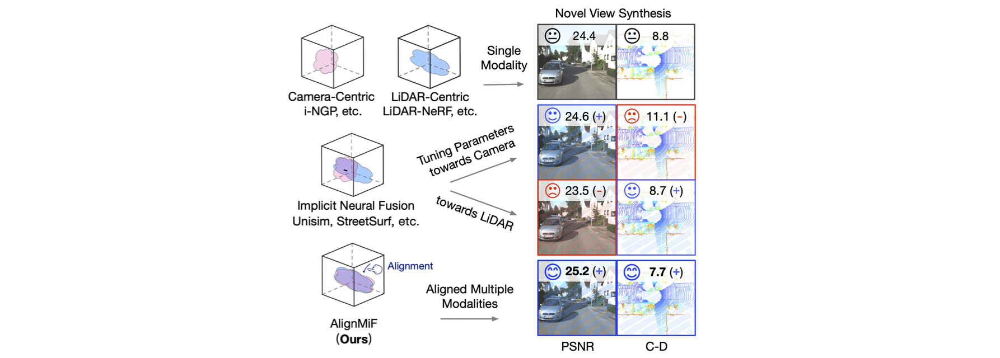

<h1 align="center">AlignMiF: Geometry-Aligned Multimodal Implicit Field for LiDAR-Camera Joint Synthesis</h1>
<h3 align="center">[CVPR 2024]</h3>
<p align="center">
   <a href="https://arxiv.org/pdf/2402.17483.pdf">
      </a>
</p>
<p align="center">
   <a href="https://scholar.google.com.hk/citations?user=1ltylFwAAAAJ&hl=zh-CN&oi=sra">Tao Tang</a>
   ·
   <a href="https://wanggrun.github.io/">Guangrun Wang</a>
   ·
   <a href="https://scholar.google.com/citations?user=2w9VSWIAAAAJ&hl=en">Yixing Lao</a>
   ·
   <a href="https://damo.alibaba.com/labs/intelligent-transportation">Peng Chen</a>
   ·
   <a href="">Jie Liu</a>
    ·
   <a href="https://www.sysu-hcp.net/faculty/lianglin.html">Liang Lin</a>
   ·
   <a href="https://scholar.google.com.hk/citations?user=Jtmq_m0AAAAJ&hl=zh-CN&oi=sra">Kaicheng Yu</a>
   ·
   <a href="https://scholar.google.com/citations?user=voxznZAAAAAJ">Xiaodan Liang</a>



This work thoroughly investigated and validated the **misalignment issue** in multimodal NeRF and propose **AlignMiF**, a geometrically aligned multimodal implicit field.

1. We perform comprehensive analyses of multimodal learning in NeRF, identifying the modality misalignment issue.
2. We propose AlignMiF, with GAA and SGI modules, to address the misalignment issue by aligning the consistent coarse geometry of different modalities while preserving their unique details.
3. We demonstrate the effectiveness of our method quantitatively and qualitatively through extensive experiments conducted on multiple datasets and scenes.


## Note

The current code is not fully ready yet. I have removed many other attempts or code belonging to future projects from the current codebase. However, there might still be some areas that haven't been properly organized or cleaned, which could potentially result in errors. Please take note of this when using the code.


## Dataset Preprocess

### KITTI-360 dataset

Prepare KITTI-360 dataset:

```bash
# Follow: https://www.cvlibs.net/datasets/kitti-360/documentation.php
$ mkdir -p data/kitti360
$ ln -s ${HOME}/data/KITTI-360 data/kitti360/KITTI-360
```

Run KITTI-360 dataset preprocessing:

```bash
# Currently, the scene and frame ids are hard-coded in the script.
# Generate train range images
python preprocess/generate_train_rangeview.py --dataset kitti360
# Generate jsons
python preprocess/kitti360_to_nerf.py
# Calculate centerpose (optional) can directly use our config
python preprocess/cal_centerpose_bound.py
```

### Waymo dataset

Prepare waymo dataset:

```bash
$ mkdir -p data/waymo/waymo_v120
$ ln -s ${HOME}/data/waymo data/waymo
```

Run waymo dataset preprocessing:

```bash
# Currently, the scene and frame ids are hard-coded in the script.
# Extract images and lidar with pose from tfrecords
python preprocess/waymo_extract_from_tfrecord.py
# Generate train range images
python preprocess/generate_train_rangeview.py --dataset waymo
# Generate jsons
python preprocess/waymo_to_nerf.py
# Calculate centerpose (optional) can directly use our config
python preprocess/cal_centerpose_bound.py --dataset waymo
```


## Dependencies

```bash
conda create -n ngp python=3.8
conda activate ngp

# Torch
pip install -r requirements_torch.txt

# Others
pip install -r requirements.txt

# tiny-cuda-nn (option 1)
# First, make sure CUDA version is the same CUDA as the one compiled PyTorch
pip install git+https://github.com/NVlabs/tiny-cuda-nn/#subdirectory=bindings/torch

# tiny-cuda-nn (option 2)
# Useful when github connection is slow
export CUDA_HOME=/usr/local/cuda
git clone https://github.com/NVlabs/tiny-cuda-nn.git
cd tiny-cuda-nn
git submodule update --init --recursive
cd bindings/torch
python setup.py install

# Camtools (assumes camtools are in ../camtools)
pushd ../camtools && pip install -e . && popd

# ChamferDistance
git submodule update --init --recursive

# Build extension (optional, not use tcnn)
pip install lidarnerf/raymarching
pip install lidarnerf/gridencoder
pip install lidarnerf/shencoder
pip install lidarnerf/freqencoder


# Install lidarnerf
pip install -e .

# Verify installation
python -c "import lidarnerf; print(lidarnerf.__version__)"
```


## Run

```bash
# single modality
python main_alignmif.py -L --workspace kitti360-1908/lidar --enable_lidar --config configs/kitti360_1908.txt
python main_alignmif.py -L --workspace kitti360-1908/rgb --enable_rgb --config configs/kitti360_1908.txt
# multimodality implicit fusion
python main_alignmif.py -L --workspace kitti360-1908/mif --enable_rgb --enable_lidar --config configs/kitti360_1908.txt --network mif
# aligmif 
python main_alignmif.py -L --workspace kitti360-1908/alignmif --enable_lidar --enable_rgb --config configs/kitti360_1908.txt --ckpt kitti360-1908/lidar/checkpoints/alignmif_ep0500.pth --activate_levels 8 --network alignmif

```


## Pre-trained Models

You can download our pre-trained models here (TODO).


## Citation

If you find our code or paper helps, please consider citing:

```bibtex
@article{tao2024AlignMiF,
    title   = {AlignMiF: Geometry-Aligned Multimodal Implicit Field for LiDAR-Camera Joint Synthesis},
    author  = {Tao, Tang and Wang, Guangrun and Lao, Yixing and Chen, Peng and Liu, Jie and Lin, Liang and Yu, Kaicheng and Liang, Xiaodan}
    journal = {arXiv preprint arXiv:2402.17483},
    year    = {2024}
}
```


## Acknowledgments

This code is built on top of the super-useful [lidar-nerf](https://github.com/tangtaogo/lidar-nerf)  and [torch-ngp](https://github.com/ashawkey/torch-ngp) implementation.

```
@article{tao2023lidar,
  title={LiDAR-NeRF: Novel LiDAR View Synthesis via Neural Radiance Fields},
  author={Tao, Tang and Gao, Longfei and Wang, Guangrun and Lao, Yixing and Chen, Peng and Zhao hengshuang and Hao, Dayang and Liang, Xiaodan and Salzmann, Mathieu and Yu, Kaicheng},
  journal={arXiv preprint arXiv:2304.10406},
  year={2023}
}
```

```
@misc{torch-ngp,
    Author = {Jiaxiang Tang},
    Year = {2022},
    Note = {https://github.com/ashawkey/torch-ngp},
    Title = {Torch-ngp: a PyTorch implementation of instant-ngp}
}
```
